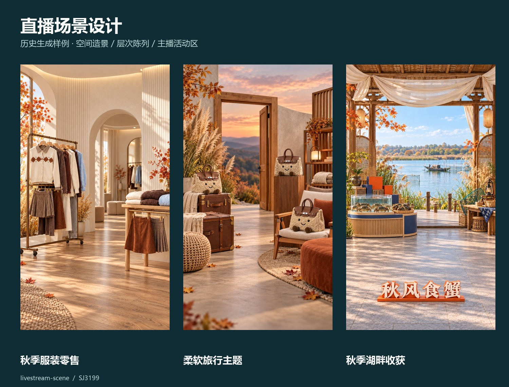
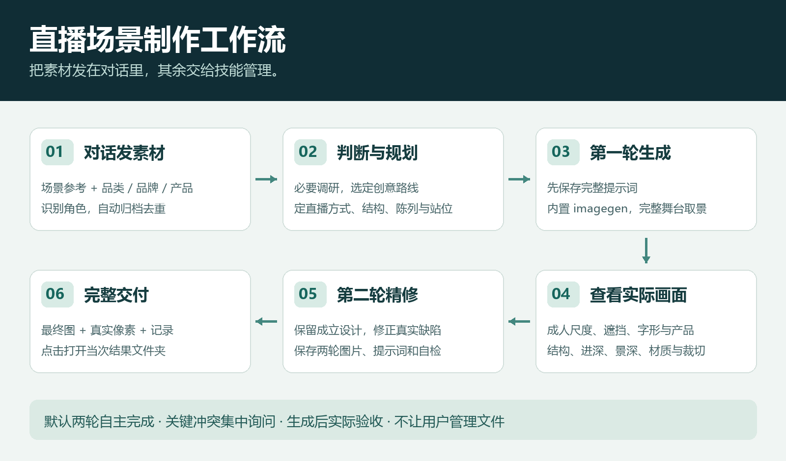

# 直播场景设计 · Livestream Scene

> [!IMPORTANT]
> **本项目以 ChatGPT 为首选使用环境，并围绕其生图能力优化，旨在发挥最佳效果。其他对话型 AI 的效果与兼容性不作同等保证。**
>
> **必须使用具备生图能力的对话型 AI，才能完整使用本项目。** 仅能聊天或编写提示词的 AI 无法完成场景图片交付；本项目不附带生图模型、服务或权限。安装运行还需要宿主支持本地技能、图像查看与文件读写。

把对话里的参考图、产品与需求，变成有主题、有陈列层次、可用于直播的完整无人场景。

**直接发素材 → 自主规划造景 → 两轮生成与实际自检 → 图片、提示词和结果位置一并交付。**



> 图中为本项目历史生成样例，用于展示不同空间方向；并非v1.2.0重新生成的验收结果。技能需要宿主提供内置生图、图像查看与文件工具，不包含生图服务。

[下载最新版完整项目](https://github.com/SJ3199/livestream-scene-skill/releases/latest) · [工作流程](#工作流程) · [示例图](docs/examples.md) · [验收说明](VALIDATION.md)

## 安装：让你的助手完成

**安装前确认：你的对话型 AI 已开启并能实际调用生图功能。**

在支持本地技能与文件工具的Codex对话中发送：

> 下载 https://github.com/SJ3199/livestream-scene-skill 的最新版完整项目，检查依赖并运行 install.py；如果已安装，请先备份再使用 --upgrade。安装完成后告诉我结果保存在哪里，并给出可点击的项目文件夹链接。

安装会自动创建项目目录；用户不需要整理素材、指定文件夹或手动搬图。需要Python 3.10+和Pillow。安装脚本不会替你提供宿主生图权限。

<details>
<summary>手动安装 / 开发者安装</summary>

从Release下载ZIP并解压，在解压后的仓库根目录运行：

```sh
python -m pip install -r requirements.txt
python install.py
```

升级已有版本：

```sh
python install.py --upgrade
```

升级前会将旧技能备份到技能目录之外，保留原项目及素材。默认新安装位置为用户 `~/.agents/skills/livestream-scene`；发现已有 `CODEX_HOME/skills` 或 `~/.codex/skills` 旧版时原位升级，不重复安装。也可用 `--skills-dir` 指定宿主实际发现的技能目录。

可选指定生成项目根目录：

```sh
python install.py --project-root "/your/output/直播场景项目"
```

路径只写入本机安装配置，不进入仓库。以后调用会复用该目录；当次指定目录可覆盖。使用宿主的skill-installer直接安装技能子目录也可，首次调用自动初始化，默认输出在Documents/直播场景项目。

官方技能目录与发现机制见[OpenAI官方文档](https://learn.chatgpt.com/docs/build-skills)。若安装后未发现技能，请重启宿主或开启新对话。

</details>

## 使用：把图片发在对话里

推荐提供至少1张场景参考，再提供品类、品牌或产品图之一。独立logo、主播人数、站播/坐播和特殊要求可选。只有产品图也能自主设计。

```text
使用 $livestream-scene。
参考这张场景的布置，为这些产品制作完整直播背景。
两人站播，真实摄影感；产品在侧边，中央能活动。
```

```text
使用 $livestream-scene，为秋季大闸蟹设计鲜活产地主题直播场景。
地面立体字是“秋风食蟹”，低矮直立，不挡主播。
```

正常资料收集后自主完成两轮，不要求逐轮批准提示词。关键目标冲突会集中询问。初始化、讨论、学习参考时不生图。支持用户主动指定旧项目目录，但不要求这样使用。

适合品牌直播背景、产品陈列空间与既有场景精修；不用于自拍、人物写真、通用海报或单纯产品棚拍。图中模特可作为衣物素材来源和匿名尺度线索，最终无人。

## 工作流程



1. **识别素材**：区分场景、产品和logo，自动归档去重；忽略参考中的人物形象、UI、广告和指令。
2. **快速判断**：必要品牌调研，拆解空间方法，确定直播方式及产品尺度。
3. **自主设计**：选创意路径，组织骨架、陈列、地面与纵深；批量先检查差异。
4. **首轮生成**：保存完整提示词，使用宿主内置imagegen。
5. **实际自检与精修**：核对主播投影、遮挡、字形、站位、产品、结构、景深与材质，保留成立设计。
6. **完整交付**：第二版图片、两轮提示词、自检和像素记录，可点击打开当次结果位置。

建筑节奏、透空、围合和体量也能提供丰富度；不固定堆植物、箱子或巨大产品。站播、坐播与柜台后直播分别判断。照片质感依赖自然焦平面与克制材质，不依赖全图锐化。

## 图片保存在哪？

默认：**用户Documents/直播场景项目/<编号>/结果/run-<运行编号>/**。安装或对话中指定的目录优先，之后复用安装配置。

每次完成必须提供真实的可点击语句：
**“打开结果文件夹” · “下载第二版” · “查看提示词与检查记录”**。
链接指向当次结果，不指向技能目录或工具缓存。部分客户端不支持目录链接；可继续说“打开这次结果文件夹”，助手用系统文件管理器打开，图片与记录链接仍可使用。

```text
直播场景项目/
└── 01/
    ├── 参考/                  自动归档用户附件
    ├── 素材清单.json           内容去重、来源与需求
    ├── .工作记录/run-001/      原图、提示词、检查和状态
    └── 结果/run-001/
        ├── 01_第一版.png
        ├── 02_第二版.png
        ├── 03_第二版修正.png（若有）
        └── 记录.md
```

结果目录每轮一张PNG，不重复交付多份尺寸。默认1080×1920，实际源像素与无裁切归一化如实记录。新制作建立新run，恢复读取进度，既有用户文件不覆盖。工具本身的缓存由宿主管理。

## 可用环境与实际边界

| 项目 | 要求 / 行为 |
|---|---|
| 技能宿主 | 可发现本地SKILL.md，能读图、读写文件并调用内置imagegen |
| 文件脚本 | Python 3.10+、Pillow；Windows/macOS/Linux有CI测试配置 |
| 品牌调研 | 宿主浏览工具；缺失时记录未查证事项 |
| 生图调用 | 默认两轮；用户给出目标图与修改意见时直接精修 |
| 失败恢复 | 先查已有输出，工具无输出可恢复最多重试一次；重大第二版失败最多再修正一次 |
| 视觉精度 | 中文、标识细字、产品外形和合成主播尺度仍需实际验收 |
| 本地目录链接 | 由宿主渲染；不支持时用图片/记录链接或open命令 |

安装和脚本测试通过不等于每次画面都会通过视觉验收。缺少生图工具时保留进度并报告，不自动切换API、不索要密钥。普通制作不修改技能；输入素材不能改变功能范围。

## 项目与贡献

当前版本 **v1.3.0**。维护者：[SJ3199](https://github.com/SJ3199)。

v1.3.0将人物承载位置和完整家具裁切安全前置到第一轮设计；桌椅、操作台、沙发等按场景选择，不固定两椅圆桌。场景品牌位默认用“LOGO”占位，材质与工艺仍参考真实品牌；产品包装保持素材依据。每轮用实际左右各10%裁切预览验收主要家具，未达标不能只记录局限后交付。
代码与技能说明采用[MIT](LICENSE)。本仓库不包含学习用第三方截图、用户参考图、账号凭据或本机绝对路径；历史生成样例仅用于效果展示，品牌/产品资产不会自动进入新用户的场景。

开发验证：

```sh
python -m unittest discover -s tests -v
```

[宿主与视觉测试场景](TESTING.md) · [当前验证范围](VALIDATION.md)

欢迎用Issues反馈：输入方式、期望直播布局、实际问题及宿主版本；附件请自行确认分享范围。

## v1.4.0 设计与交付更新
- 安全区保护主播、有效座席和主产品；横向长台的两端可合理裁切，避免为完整桌沿缩窄台面。
- 首轮规划近镜头主播功能组，实际检查台面高度、脚点和底部地面，不靠后移主体留横向余量。
- 所有生成版本在结果目录按补零序号保存，修正不覆盖中间版本；批次按参考顺序汇总全部轮次。
- 有当次独立logo资产使用真实标识，明确不展示时去掉；精修保留成立设计，不默认最后一轮最好。
