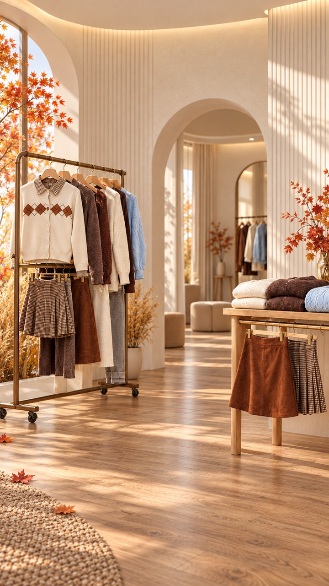
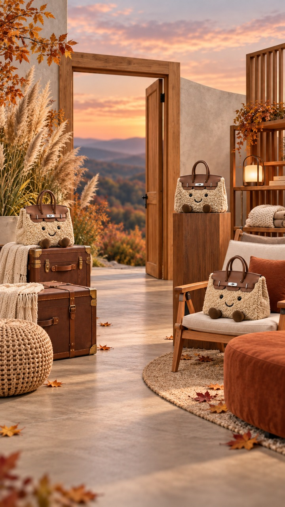
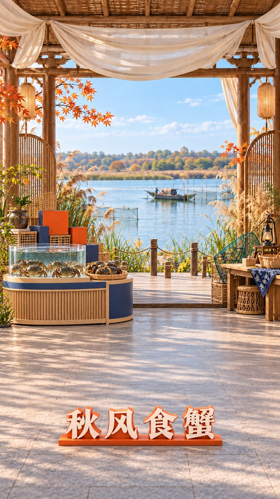

# 历史生成样例
以下三张由本项目历史工作流通过内置imagegen生成，展示不同空间方向；均为无人场景，不是学习用第三方截图。它们早于v1.2.0，保留历史效果，不作为本次新版验收证明。源图与生成提示词留在维护者本地项目，公开包仅含去除文件元数据的展示尺寸副本，不含原参考资产和本机路径。

| 示例 | 空间方法 | 仍需验收的部分 |
|---|---|---|
| [秋季服装零售](assets/fashion.jpg) | 拱洞纵深、可移动衣架、台面高低陈列 | 最外侧辅助衣物靠边、木地板纹理偏密 |
| [柔软旅行主题](assets/handbag.jpg) | 门洞借景、旅行箱与软装群组、主题触感 | 右前景产品较靠边、织物细节较强 |
| [秋季湖畔收获](assets/crab.jpg) | 亭架轻围合、鲜活展示、低前缘字、侧后收纳 | 左侧展示靠边、材质细纹理仍需克制 |

这些示例只用于展示空间设计方法，不会安装为技能输入或自动植入用户场景。画面中的产品为对应历史需求的概念表达，不代表第三方品牌合作。
